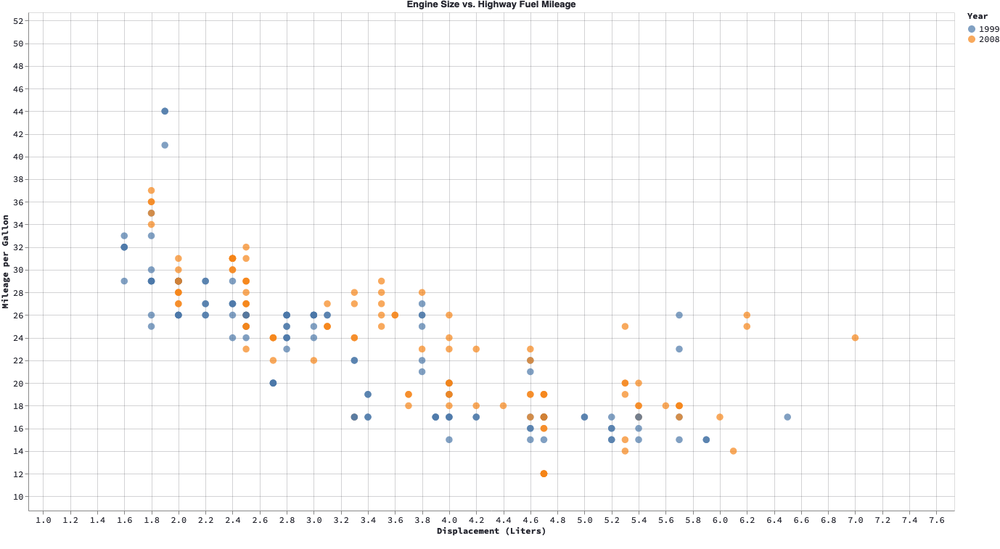

# streamlit-automotive

Streamlit app - Exercise comparing plotting libraries - matplotlib, plotly and altair
with miles per gallon dataset, rendering an interactive visualization of car models' motor size and their mileage on highway and in city.

https://scopalaffairs-streamlit-automotive-automotive-hz51ko.streamlit.app/
